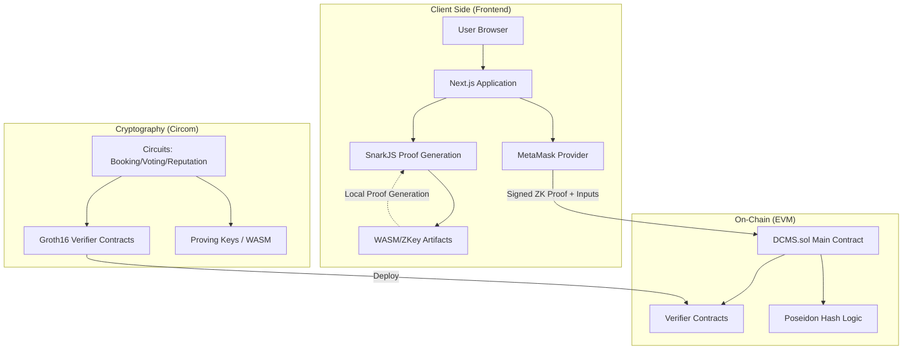

# DCMS: Decentralized Cottage Management System

DCMS is a sophisticated, decentralized framework for managing shared assets through a "Privacy by Design" lens. Built on the Ethereum ecosystem, it leverages Zero-Knowledge Cryptography (ZK-SNARKs) to ensure that resource bookings, user identities, and governance participation are cryptographically verifiable while maintaining strict confidentiality.

---

##  Architecture Overview

DCMS employs a modular, high-performance stack designed for trustless execution and client-side privacy.



- **Cryptographic Layer**: Utilizes Circom-based **Groth16 circuits** to define and enforce privacy constraints.
- **Protocol Layer**: Solidity 0.8.24 smart contracts acting as immutable state orchestrators and ZK verifiers.
- **Application Layer**: A reactive Next.js 14 infrastructure performing client-side WASM proof generation via SnarkJS.

---

##  Key Capabilities

###  Privacy-Preserving Resource Allocation
Implements cryptographic commitments to allow users to book resources without disclosing their wallet address or sensitive booking secrets in the public transaction state.

###  Confidential Governance
A robust "one-identity-one-vote" mechanism utilizing ZK nullifiers to prevent double-voting while maintaining total voter anonymity.

###  Verifiable Reputation (ZK-Thresholds)
Enables users to prove specific reputation tiers (e.g., "Verified Booker") through threshold proofs without exposing their granular transaction history.

###  Automated Conflict Resolution
On-chain logic ensures atomic availability checks and prevents double-booking conflicts within the zero-knowledge verification pipeline.

---

##  Technology Stack

| Component | Technology |
| :--- | :--- |
| **Smart Contracts** | Solidity 0.8.24, Hardhat |
| **ZK Cryptography** | Circom, SnarkJS (Groth16) |
| **Hashing Primitive**| Poseidon (circomlibjs) |
| **Frontend Framework** | Next.js 14 (App Router), TypeScript |
| **Styling Engine** | Tailwind CSS |
| **Web3 Connectivity** | Ethers.js v6 |
| **Identity Provider** | MetaMask |

---

##  Project Structure

```text
/
├── contracts/                   # Core Protocol & Cryptography
│   ├── contracts/DCMS.sol       # Main logic and ZK orchestration
│   ├── contracts/*Verifier.sol  # On-chain Groth16 verifiers
│   ├── circuits/                # Circom circuit definitions
│   ├── scripts/                 # Deployment and build automation
│   └── test/                    # Full-coverage ZK flow integration tests
└── frontend/                    # Application Layer
    ├── public/zk/               # Proving keys and WASM artifacts
    └── src/
        ├── app/                 # UI layers (Resources, Bookings, Governance)
        ├── components/          # Shared atomic UI components
        └── lib/                 # ZK helpers and Web3 middleware
```

---

##  Installation & Deployment

### Prerequisites
- Node.js 18.x+
- MetaMask Browser Extension

### 1. Initialize Dependencies
```bash
# Install core dependencies
cd contracts && npm install
cd ../frontend && npm install
```

### 2. Orchestrate Local Network
```bash
# Start a local EVM-compatible node
cd contracts
npx hardhat node
```

### 3. Deploy Protocol & Verifiers
```bash
# Execute deployment script to localhost
npx hardhat run scripts/deploy.js --network localhost
```

### 4. Launch Application
```bash
# Run the Next.js development server
cd frontend
npm run dev
```

---

##  Local Network Configuration

To interact with the protocol locally, configure your MetaMask wallet to connect to the Hardhat node:

### 1. Register Local Network
Add a custom network in MetaMask with the following parameters:

| Parameter | Value |
| :--- | :--- |
| **Network Name** | DCMS Local |
| **RPC URL** | `http://127.0.0.1:8545` |
| **Chain ID** | `31337` |
| **Currency Symbol** | ETH |

### 2. Import Development Accounts
After starting the Hardhat node (`npx hardhat node`), import one of the provided private keys into MetaMask to access test funds. 
- **Note**: Account #0 is configured as the default **System Administrator**.

---

##  Developer Guide

###  ZK Circuit Pipeline
If you modify the Circom circuits in `contracts/circuits/`, you must rebuild the artifacts:
```bash
cd contracts
node scripts/build-circuits.js
```
This script automates:
1.  **Compilation**: Generates R1CS and WASM.
2.  **Setup**: Executes Groth16 trusted setup (Powers of Tau).
3.  **Verifier Export**: Generates and renames Solidity verifiers.
4.  **Sync**: Copies `.wasm`, `.zkey`, and `vkey.json` to the frontend `public/` directory.

###  Utility Scripts
Located in `contracts/scripts/` for state inspection:
- `checkAdmin.js`: Verify administrative privileges.
- `checkBookings.js`: Inspect on-chain commitments and nullifiers.
- `checkBalances.js`: Verify ETH levels across test accounts.

###  Automated Testing
Execute the integration suite to verify ZK proof validity and on-chain logic:
```bash
cd contracts
npx hardhat test
```

---

##  Security & Privacy Standards

- **Cryptographic Verification**: Every sensitive action (Booking, Voting, Reputation Claim) requires a valid Groth16 proof verified by dedicated on-chain verifier contracts.
- **Nullifier Protocol**: A robust nullification system prevents replay attacks and double-utilization of resource commitments.
- **Administrative Access Control**: Critical resource management functions are strictly gated using standard Access Control patterns.
- **Privacy Boundary**: While ZK-SNARKs mask metadata, transaction originators (sender addresses) are still visible on-chain as per standard Ethereum protocols.
